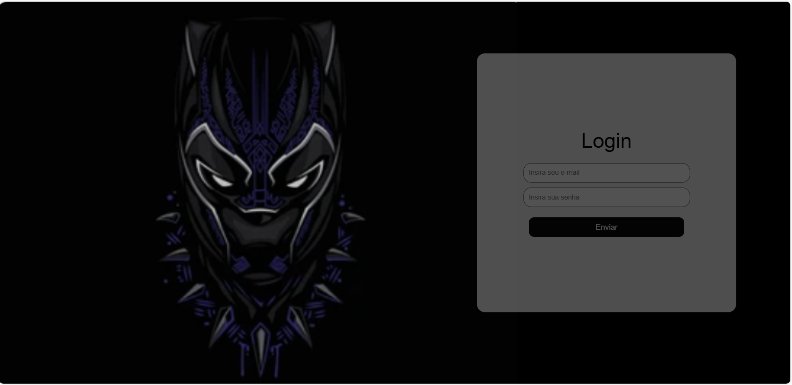

# Login Page

## Senai - Atividade 6

Criar uma tela de login e personalizá-la usando HTML e CSS.


## Como baixar e rodar o projeto localmente

1. Clone o repositório:
	```powershell
	git clone https://github.com/Pietro-dev-front/login-page.git
	```
2. Abra a pasta do projeto:
	```powershell
	cd login-page/atividade-login/atividade-login
	```
3. Execute o arquivo `index.html` no navegador:
	```powershell
	start index.html
	```


---


